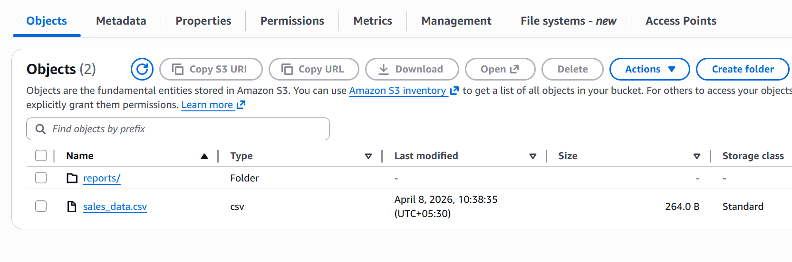
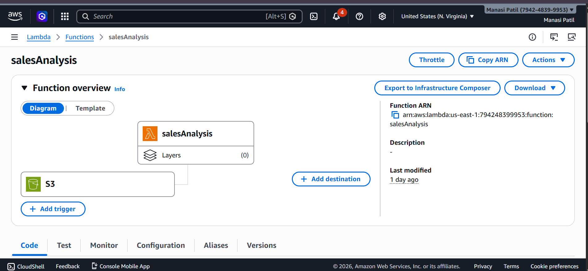
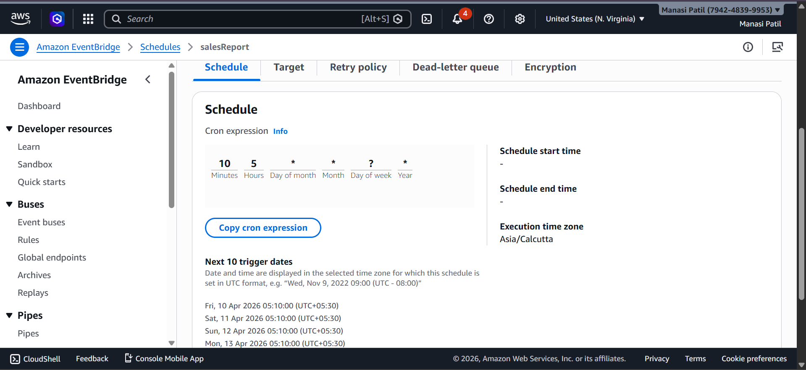
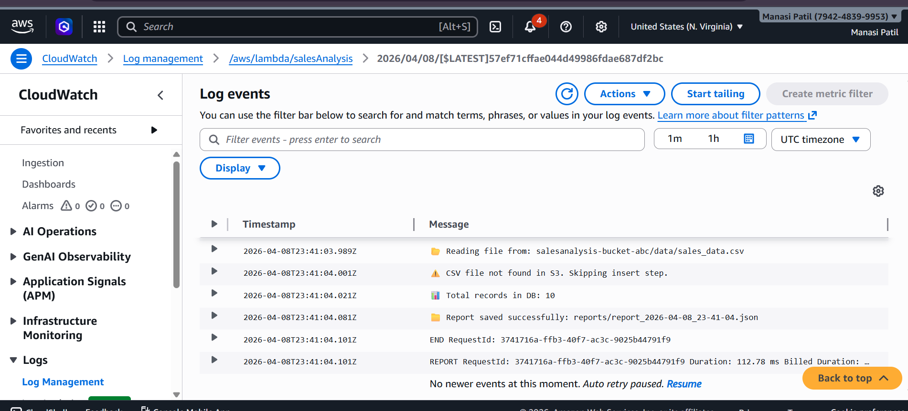

# 🚀 Serverless Sales Analysis Pipeline using AWS

## 📌 Project Overview
This project demonstrates an automated serverless data pipeline using AWS services to analyze sales data daily and store processed reports in S3.

---

## 🛠️ Technologies Used
- AWS Lambda
- Amazon S3
- Amazon EventBridge
- Amazon CloudWatch
- Python (Boto3, Pandas)

---

## ⚙️ Architecture Diagram

---

## 🔄 Workflow

1. Sales data (CSV) is uploaded to S3
2. EventBridge triggers Lambda daily
3. Lambda:
   - Reads CSV from S3
   - Performs analysis
   - Generates JSON report
4. Report stored back in S3
5. Logs monitored in CloudWatch

---

## 📸 Screenshots

### 🔹 S3 Bucket

### 🔹 Lambda Function

### 🔹 EventBridge Schedule

### 🔹 CloudWatch Logs

---

## 🧠 Key Features
- Fully serverless architecture
- Automated daily execution
- Cost-efficient (no servers)
- Scalable and event-driven

---

## 📂 Sample Input
`sales_data.csv`

## 📤 Sample Output
`report.json`

---

## 🚀 Future Improvements
- Add DynamoDB for storing insights
- Add API Gateway for real-time access
- Visualization dashboard (QuickSight)

---

## 👩‍💻 Author
Manasi .R .Patil
